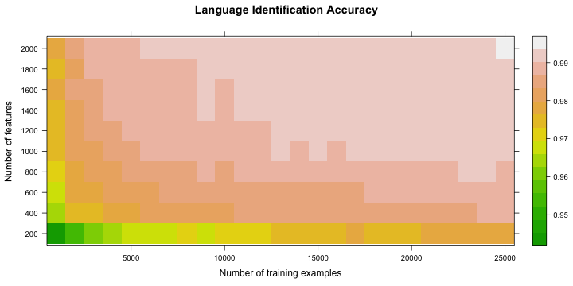
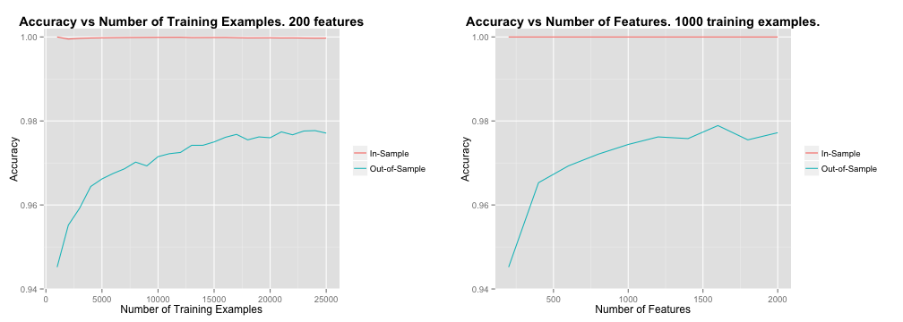

<style>
.title-slide {
  background-color: #EDEDFF;
}

.title-slide hgroup > h1, 
.title-slide hgroup > h2 {
  color: #222244;
}

</style>

## Language Identification 

* Using Random Forests To Identify Language of EU Proceedings
* Sentence-based identification (no need for long texts)
* Features used are N-grams, inspired by the TextCat algorithm by Cavnar and Trenkle.
* Simple web app for analysis found at http://sorenlind.shinyapps.io/webapp
* Slides available on [GitHub pages](http://sorenlind.github.io/DataProductsLanguageIdentificationSlides/)
* Source code for web app and slides available on [GitHub](https://github.com/sorenlind/DataProductsLanguageIdentification)

--- &vcenter

## High Accuracy

When trained on 25,000 sentences, using 2000 features, an out-of-sample accuracy >99% is achieved.



--- &vcenter

## Plot Accuracy vs Number of Features or Number of Examples

* Web app lets you lot plot the accuracy against either the number of features or the number of training examples.





---

## Fun Fact - Where is the Beef?

The in-sample accuracy is less than 1.0 when training on thousands of examples. This may point to underfitting. But in this case it does not. Instead, it is caused by errors in the training data. A few of the non-English training examples contain English text which the classifier correctly indentifies as English. Since these sentences are labeled as non-English they show up as errors. In other words, running the classifier on the training data reveals errors in the training data!


```r
inSampleErrorsFilePath <- file.path(resultsPath, 'inSampleErrors.txt')
inSampleErrorsDf <- read.table(file = inSampleErrorsFilePath)
kable(inSampleErrorsDf)
```


|      |Prediction |Actual    |Text              |
|:-----|:----------|:---------|:-----------------|
|5108  |English    |Norwegian |Where is the beef |
|12355 |English    |Finnish   |Where is the beef |

